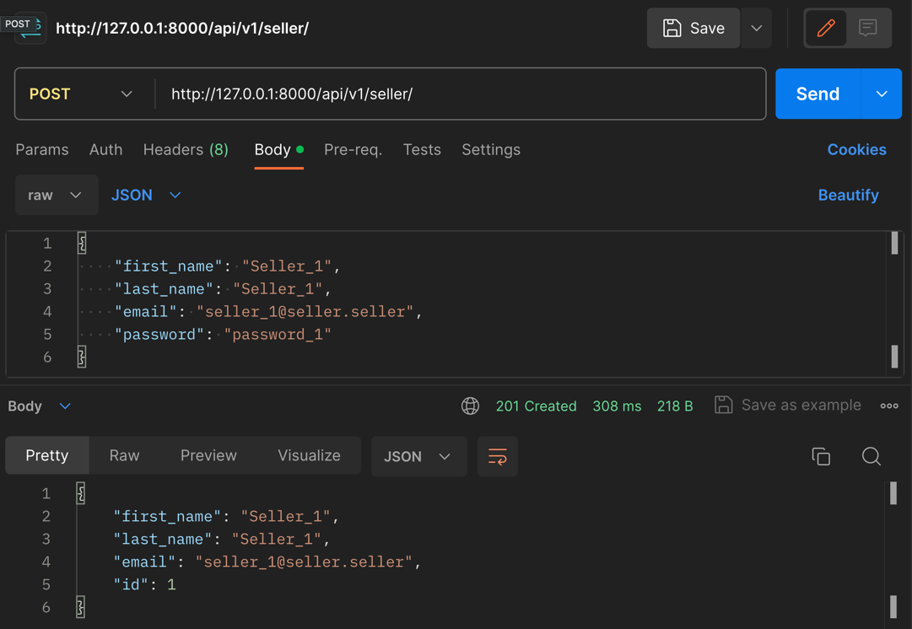
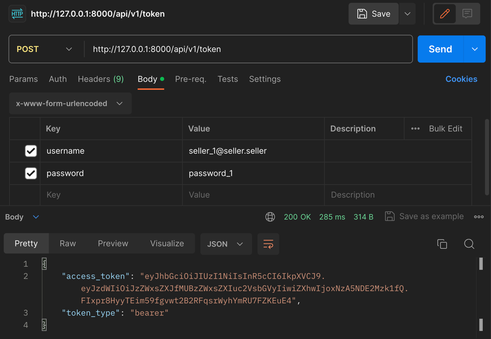
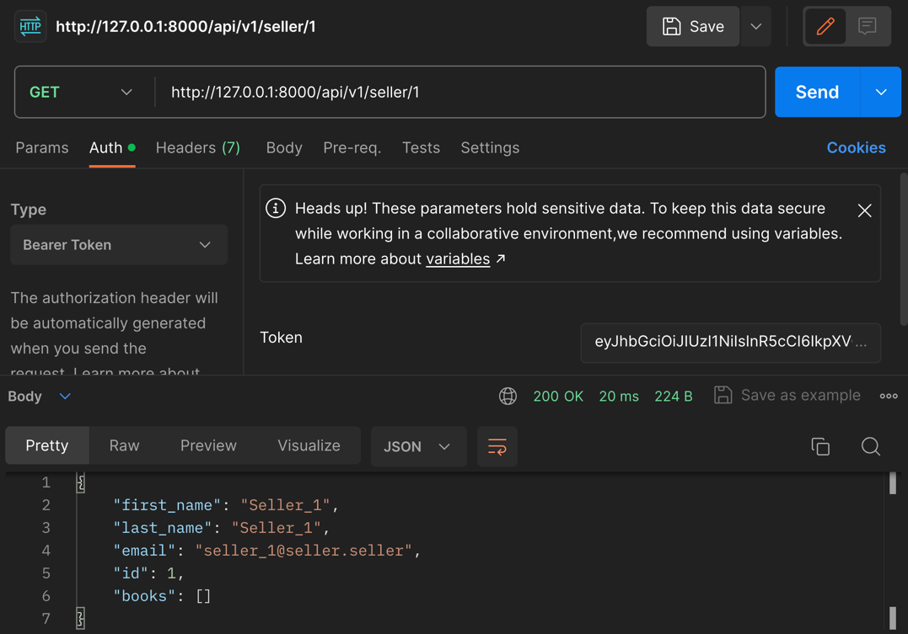
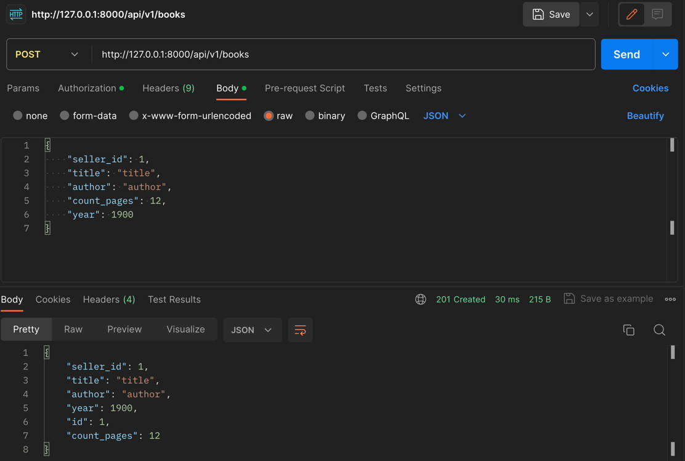
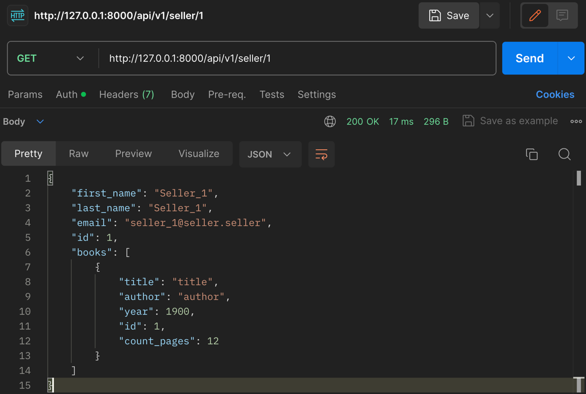
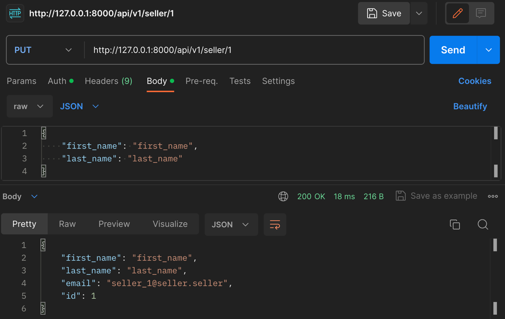
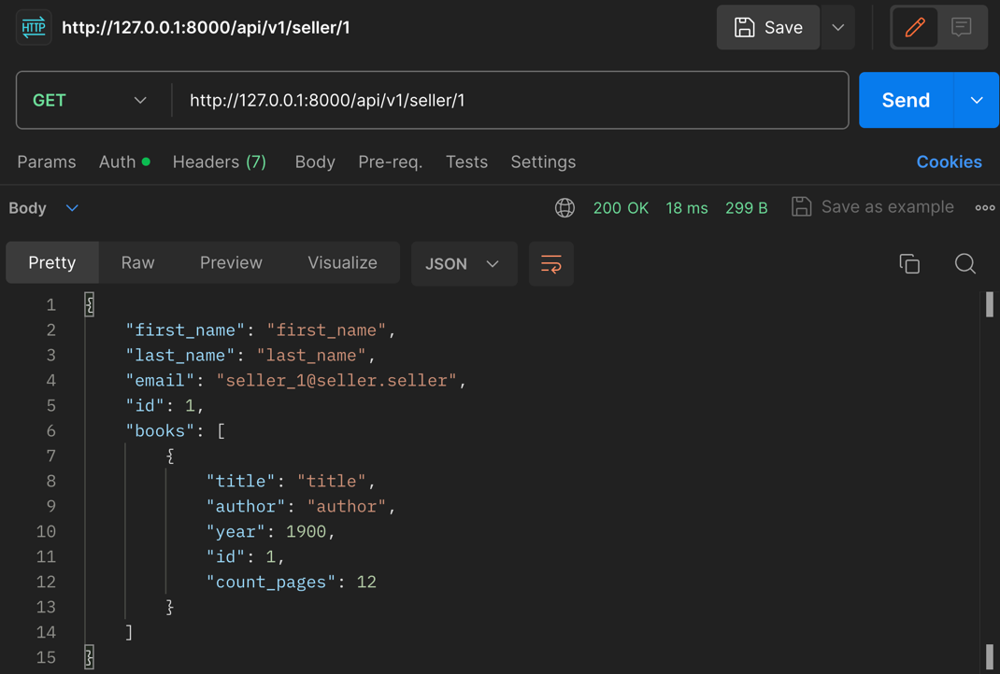

# Book Selling Platform Announcement / Платформа объявлений о продаже книг

## Project Description / Описание проекта

ENG: The project is created for educational purposes. It is a platform for book selling announcements.

RUS: Проект создан в учебных целях. Представляет собой платформу объявлений о продаже книг.

## Application Launch / Запуск приложения

ENG: Commands are executed in the console / RUS: Команды вызываются в консоли:

#### Copy .env.example and change the name to .env / Скопируйте .env.example и измените имя на .env

#### Deploying Postgres DB in a docker container / Развертка БД Postgres в docker-контейнере
```shell
make up_compose
```
#### Installing dependencies for the FastAPI server / Установка зависимостей для FastAPI сервера
```shell
make install_reqs
```
#### Starting the FastAPI server / Запуск FastAPI сервера
```shell
make start_app
```

#### Stopping the server / Остановка сервера

Win: ctrl + c, MacOS: control + c

## Useful Information / Полезная информация

ENG: A **Makefile** with useful commands has been added to the repository. The commands are called in the console in this way:

RUS: В репозиторий добавлен **Makefile** с полезными командами. Команды вызываются в консоли вот таким образом:

```shell
make linters

make install_reqs
```
## Project Structure / Структура проекта

ENG: For convenience and adherence to the principles of clean architecture, the project is divided into the following packages:

RUS: Для удобства и соблюдения принципов чистой архитектуры проект разделен на следующие пакеты:

- `configurations` — ENG: layer for storing configurations, constants, parameters, and project settings. / RUS: слой для хранения конфигураций, констант, параметров и настроек проекта.
- `models` — ENG: layer for storing models (ORM or Data Classes). / RUS: слой для хранения моделей (ORM или Data Classes).
- `routers` — ENG: layer for setting URLs for different endpoints. / RUS: слой для настроек урлов для различных эндпоинтов.
- `schemas` — ENG: layer containing pydantic schemes, responsible for serialization and validation. / RUS: слой, содержащий схемы pydantic, отвечает за сериализацию и валидацию.
- `service` — ENG: layer containing commands for database access. / RUS: слой, содержащий команды для обращения к базе данных.
- `tests` — ENG: layer containing tests of the handlers. / RUS: слой, содержащий тесты ручек.

## Testing through Pytest / Тестирование через Pytest

16 tests: 16 passed, 37 warnings

## Testing Results through Postman / Результаты тестирования через Postman

ENG: All commands were executed sequentially.

RUS: Все команды выполнены последовательно.







